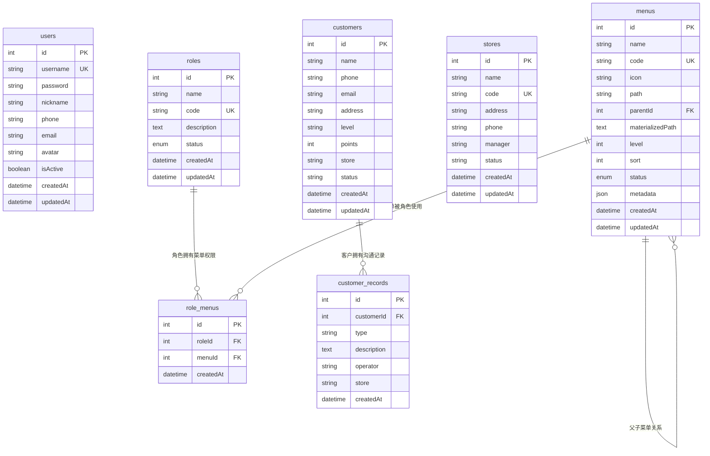

          
# VV-Manager CRM 系统数据库设计文档

## 概述

VV-Manager 是一个基于 NestJS 和 TypeORM 的客户关系管理系统，采用 RBAC（基于角色的访问控制）权限模型。本文档详细描述了系统的数据库设计，包括表结构、字段定义和实体关系。

## ER 图



## 数据表详细设计

### 1. 用户表 (users)

**表名：** `users`  
**描述：** 存储系统用户信息

| 字段名 | 类型 | 长度 | 约束 | 默认值 | 描述 |
|--------|------|------|------|--------|---------|
| id | INT | - | PK, AUTO_INCREMENT | - | 主键 |
| username | VARCHAR | 50 | UNIQUE, NOT NULL | - | 用户名 |
| password | VARCHAR | 255 | NOT NULL | - | 密码（加密） |
| nickname | VARCHAR | 50 | NULL | NULL | 昵称 |
| phone | VARCHAR | 15 | NULL | NULL | 手机号 |
| email | VARCHAR | 255 | NULL | NULL | 邮箱 |
| avatar | VARCHAR | 255 | NULL | NULL | 头像URL |
| isActive | BOOLEAN | - | NOT NULL | true | 是否激活 |
| createdAt | DATETIME | - | NOT NULL | CURRENT_TIMESTAMP | 创建时间 |
| updatedAt | DATETIME | - | NOT NULL | CURRENT_TIMESTAMP | 更新时间 |

**索引：**
- PRIMARY KEY (`id`)
- UNIQUE KEY (`username`)

### 2. 角色表 (roles)

**表名：** `roles`  
**描述：** 存储系统角色信息

| 字段名 | 类型 | 长度 | 约束 | 默认值 | 描述 |
|--------|------|------|------|--------|---------|
| id | INT | - | PK, AUTO_INCREMENT | - | 主键 |
| name | VARCHAR | 100 | NOT NULL | - | 角色名称 |
| code | VARCHAR | 100 | UNIQUE, NOT NULL | - | 角色编码 |
| description | TEXT | - | NULL | NULL | 角色描述 |
| status | ENUM | - | NOT NULL | 'active' | 状态：active/inactive |
| createdAt | DATETIME | - | NOT NULL | CURRENT_TIMESTAMP | 创建时间 |
| updatedAt | DATETIME | - | NOT NULL | CURRENT_TIMESTAMP | 更新时间 |

**索引：**
- PRIMARY KEY (`id`)
- UNIQUE KEY (`code`)
- INDEX (`status`)

### 3. 菜单表 (menus)

**表名：** `menus`  
**描述：** 存储系统菜单信息，支持树形结构

| 字段名 | 类型 | 长度 | 约束 | 默认值 | 描述 |
|--------|------|------|------|--------|---------|
| id | INT | - | PK, AUTO_INCREMENT | - | 主键 |
| name | VARCHAR | 100 | NOT NULL | - | 菜单名称 |
| code | VARCHAR | 100 | UNIQUE, NOT NULL | - | 菜单编码 |
| icon | VARCHAR | 100 | NULL | NULL | 菜单图标 |
| path | VARCHAR | 255 | NULL | NULL | 菜单路径 |
| parentId | INT | - | NULL | NULL | 父级菜单ID |
| materializedPath | TEXT | - | NULL | NULL | 物化路径 |
| level | INT | - | NOT NULL | 0 | 层级深度 |
| sort | INT | - | NOT NULL | 0 | 排序值 |
| status | ENUM | - | NOT NULL | 'enabled' | 状态：enabled/disabled |
| metadata | JSON | - | NULL | NULL | 菜单元数据 |
| createdAt | DATETIME | - | NOT NULL | CURRENT_TIMESTAMP | 创建时间 |
| updatedAt | DATETIME | - | NOT NULL | CURRENT_TIMESTAMP | 更新时间 |

**索引：**
- PRIMARY KEY (`id`)
- UNIQUE KEY (`code`)
- INDEX (`parentId`, `sort`)
- INDEX (`path`)
- INDEX (`status`)
- FOREIGN KEY (`parentId`) REFERENCES `menus`(`id`)

### 4. 角色菜单关联表 (role_menus)

**表名：** `role_menus`  
**描述：** 角色与菜单的多对多关联表

| 字段名 | 类型 | 长度 | 约束 | 默认值 | 描述 |
|--------|------|------|------|--------|---------|
| id | INT | - | PK, AUTO_INCREMENT | - | 主键 |
| roleId | INT | - | NOT NULL | - | 角色ID |
| menuId | INT | - | NOT NULL | - | 菜单ID |
| createdAt | DATETIME | - | NOT NULL | CURRENT_TIMESTAMP | 创建时间 |

**索引：**
- PRIMARY KEY (`id`)
- UNIQUE KEY (`roleId`, `menuId`)
- FOREIGN KEY (`roleId`) REFERENCES `roles`(`id`) ON DELETE CASCADE
- FOREIGN KEY (`menuId`) REFERENCES `menus`(`id`) ON DELETE CASCADE

### 5. 门店表 (stores)

**表名：** `stores`  
**描述：** 存储门店信息

| 字段名 | 类型 | 长度 | 约束 | 默认值 | 描述 |
|--------|------|------|------|--------|---------|
| id | INT | - | PK, AUTO_INCREMENT | - | 主键 |
| name | VARCHAR | 100 | NOT NULL | - | 门店名称 |
| code | VARCHAR | 50 | UNIQUE, NOT NULL | - | 门店编码 |
| address | VARCHAR | 255 | NOT NULL | - | 门店地址 |
| phone | VARCHAR | 20 | NOT NULL | - | 联系电话 |
| manager | VARCHAR | 50 | NOT NULL | - | 店长 |
| status | VARCHAR | 20 | NOT NULL | 'enabled' | 状态 |
| createdAt | DATETIME | - | NOT NULL | CURRENT_TIMESTAMP | 创建时间 |
| updatedAt | DATETIME | - | NOT NULL | CURRENT_TIMESTAMP | 更新时间 |

**索引：**
- PRIMARY KEY (`id`)
- UNIQUE KEY (`code`)

### 6. 客户表 (customers)

**表名：** `customers`  
**描述：** 存储客户信息

| 字段名 | 类型 | 长度 | 约束 | 默认值 | 描述 |
|--------|------|------|------|--------|---------|
| id | INT | - | PK, AUTO_INCREMENT | - | 主键 |
| name | VARCHAR | 100 | NOT NULL | - | 客户姓名 |
| phone | VARCHAR | 20 | NOT NULL | - | 手机号 |
| email | VARCHAR | 255 | NOT NULL | - | 邮箱 |
| address | VARCHAR | 255 | NULL | NULL | 地址 |
| level | VARCHAR | 20 | NOT NULL | - | 客户等级：normal/vip/premium |
| points | INT | - | NOT NULL | 0 | 积分 |
| store | VARCHAR | 50 | NOT NULL | - | 所属门店 |
| status | VARCHAR | 20 | NOT NULL | - | 状态：active/inactive/blacklist |
| createdAt | DATETIME | - | NOT NULL | CURRENT_TIMESTAMP | 创建时间 |
| updatedAt | DATETIME | - | NOT NULL | CURRENT_TIMESTAMP | 更新时间 |

**索引：**
- PRIMARY KEY (`id`)
- INDEX (`phone`)
- INDEX (`email`)
- INDEX (`store`)
- INDEX (`status`)

### 7. 客户记录表 (customer_records)

**表名：** `customer_records`  
**描述：** 存储客户沟通记录

| 字段名 | 类型 | 长度 | 约束 | 默认值 | 描述 |
|--------|------|------|------|--------|---------|
| id | INT | - | PK, AUTO_INCREMENT | - | 主键 |
| customerId | INT | - | NOT NULL | - | 客户ID |
| type | VARCHAR | 20 | NOT NULL | - | 记录类型：phone/email/visit/other |
| description | TEXT | - | NOT NULL | - | 记录描述 |
| operator | VARCHAR | 50 | NOT NULL | - | 操作员 |
| store | VARCHAR | 50 | NOT NULL | - | 门店 |
| createdAt | DATETIME | - | NOT NULL | CURRENT_TIMESTAMP | 创建时间 |

**索引：**
- PRIMARY KEY (`id`)
- INDEX (`customerId`)
- INDEX (`type`)
- INDEX (`createdAt`)
- FOREIGN KEY (`customerId`) REFERENCES `customers`(`id`) ON DELETE CASCADE

## 实体关系说明

### 1. 权限管理关系

- **角色 ↔ 菜单**：多对多关系，通过 `role_menus` 关联表实现
- **菜单自关联**：支持树形结构，通过 `parentId` 实现父子关系

### 2. 客户管理关系

- **客户 ↔ 客户记录**：一对多关系，一个客户可以有多条沟通记录

### 3. 独立实体

- **用户表**：目前为独立实体，未与其他表建立外键关系
- **门店表**：目前为独立实体，未与其他表建立外键关系

## 待完善的关系

### 1. 用户角色关系

**建议新增表：** `user_roles`

```sql
CREATE TABLE user_roles (
    id INT PRIMARY KEY AUTO_INCREMENT,
    userId INT NOT NULL,
    roleId INT NOT NULL,
    createdAt DATETIME DEFAULT CURRENT_TIMESTAMP,
    UNIQUE KEY uk_user_role (userId, roleId),
    FOREIGN KEY (userId) REFERENCES users(id) ON DELETE CASCADE,
    FOREIGN KEY (roleId) REFERENCES roles(id) ON DELETE CASCADE
);
```

### 2. 用户门店关系

**建议修改：** 在 `users` 表中添加 `storeId` 字段

```sql
ALTER TABLE users ADD COLUMN storeId INT NULL;
ALTER TABLE users ADD FOREIGN KEY (storeId) REFERENCES stores(id);
```

### 3. 客户门店关系

**建议修改：** 将 `customers` 表中的 `store` 字段改为外键

```sql
ALTER TABLE customers CHANGE COLUMN store storeId INT NOT NULL;
ALTER TABLE customers ADD FOREIGN KEY (storeId) REFERENCES stores(id);
```

### 4. 操作员关系

**建议修改：** 将 `customer_records` 表中的 `operator` 字段改为外键

```sql
ALTER TABLE customer_records CHANGE COLUMN operator operatorId INT NOT NULL;
ALTER TABLE customer_records ADD FOREIGN KEY (operatorId) REFERENCES users(id);
```

## 数据库配置

### TypeORM 配置

当前项目使用 TypeORM 的 `synchronize: true` 模式进行开发，这意味着：

- 数据库结构会自动与实体定义同步
- 适合开发环境快速迭代
- 生产环境建议关闭并使用迁移脚本

### 建议的生产环境配置

1. 设置 `synchronize: false`
2. 创建 `data-source.ts` 配置文件
3. 添加迁移脚本到 `package.json`
4. 使用版本控制管理数据库变更

## 总结

当前系统已实现：
- ✅ 基础的 RBAC 权限控制框架
- ✅ 菜单管理（支持树形结构）
- ✅ 角色管理
- ✅ 客户管理和沟通记录
- ✅ 门店基础信息管理
- ✅ 用户基础信息管理

待完善功能：
- ⏳ 用户与角色的关联
- ⏳ 用户与门店的关联
- ⏳ 客户与门店的外键关联
- ⏳ 操作员与用户的关联
- ⏳ 完整的权限验证机制

系统整体完成度约为 **70%**，核心的数据模型已经建立，主要需要完善实体间的关联关系和权限控制逻辑。
        